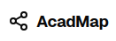
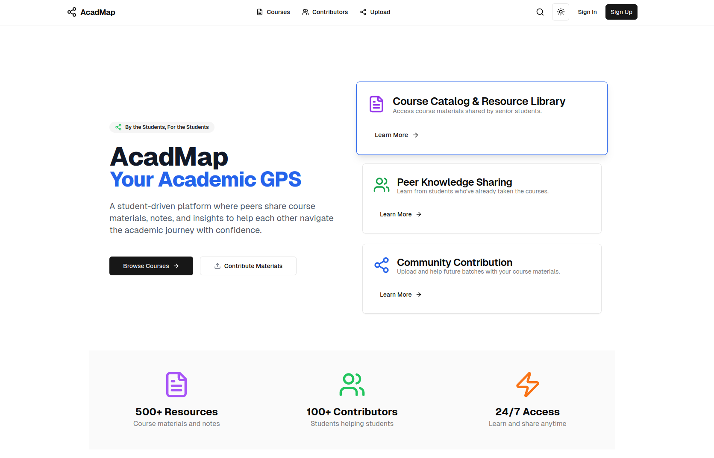

<br/>
<div align="center">
<a href="https://github.com/amaydixit11/acadmap">

</a>
<h1 align="center">AcadMap</h1>
<p align="center">
A platform to share and explore academic resources built for students of IIT Bhilai.
<br/>
<br/>
<a href="https://github.com/amaydixit11/acadmap/"><strong>Explore the docs »</strong></a>
<br/>
<br/>
<a href="https://acadmap.vercel.app">View Demo</a>
·
<a href="https://github.com/amaydixit11/acadmap/issues/new?labels=bug&template=bug-report---.md">Report Bug</a>
·
<a href="https://github.com/amaydixit11/acadmap/issues/new?labels=enhancement&template=feature-request---.md">Request Feature</a>
</p>
</div>

## About The Project



AcadMap is a collaborative tool designed to simplify resource sharing among students of IIT Bhilai. It allows students to contribute course materials, notes, and other valuable insights, fostering a sense of academic community.

Key Features:
- Easy upload and download of materials.
- Search and filter by courses and topics.
- OAuth-based authentication for security and privacy.

### Built With


## Getting Started

Follow these instructions to set up the project locally.

### Prerequisites

- Install npm:
  ```sh
  npm install npm@latest -g
  ```

### Installation

1. Clone the repository:
   ```sh
   git clone https://github.com/amaydixit11/acadmap.git
   ```
2. Install dependencies:
   ```sh
   npm install
   ```
3. Set up environment variables in `.env`:
   ```env
    NEXT_PUBLIC_SUPABASE_URL=your_supabase_url
    NEXT_PUBLIC_SUPABASE_ANON_KEY=your-anon-key
    NEXT_PUBLIC_GITHUB_TOKEN=your-GITHUB_TOKEN
    NEXT_PUBLIC_GITHUB_USERNAME=your-GITHUB_USERNAME
    NEXT_PUBLIC_GITHUB_ORG=your-GITHUB_ORG
    NEXT_PUBLIC_ORIGIN=website-url-deployed
   ```

4. Start the development server:
   ```sh
   npm run dev
   ```

## Usage

Log in using your IIT Bhilai credentials, browse through shared resources, or upload your own. The platform encourages peer-to-peer learning and academic growth.

_For more detailed usage instructions, refer to the [Documentation](https://github.com/amaydixit11/acadmap)._

## Roadmap

- [x] Responsive Design
- [x] File Upload and Download
- [ ] Add Dark Mode
- [ ] Implement Search Bar in Header
- [ ] Introduce Gamification (e.g., Contributor Badges)
- [ ] Enable User Profiles
- [ ] Add Upvote Features For Resources
- [ ] Expand Features for Group Discussions

See the [open issues](https://github.com/amaydixit11/acadmap/issues) for more details on future developments.

## Contributing

Contributions are highly welcomed! Follow these steps to contribute:
1. Fork the repository.
2. Create a feature branch (`git checkout -b feature/<feature_name>`).
3. Commit your changes (`git commit -m "Add <feature_name>"`).
4. Push to the branch (`git push origin feature/<feature_name>`).
5. Open a pull request.

Don’t forget to star the repository if you find it useful!

## License

This project is licensed under the MIT License. See the [LICENSE](https://github.com/amaydixit11/acadmap/blob/main/LICENSE) for more details.

## Contact

Amay Dixit - [GitHub Profile](https://github.com/amaydixit11)
Project Link: [https://github.com/amaydixit11/acadmap](https://github.com/amaydixit11/acadmap)

## Acknowledgments

- Thanks to all the contributors who made this project possible.
- Resources:
  - [Supabase Documentation](https://supabase.com/docs)
  - [Next.js Documentation](https://nextjs.org/docs)
  